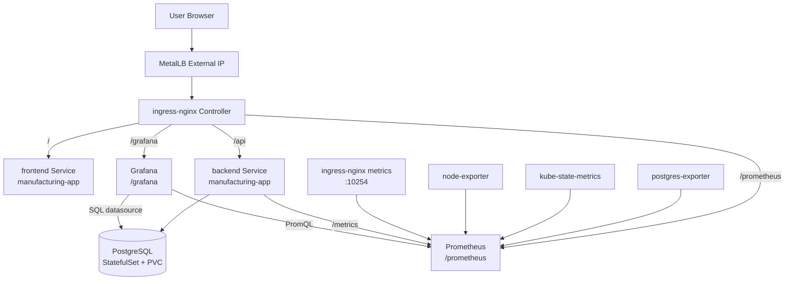

# Manufacturing Scheduler

생산 일정 관리 시스템 — Next.js + FastAPI + PostgreSQL + Nginx 풀스택 보일러플레이트

## 아키텍처

현재 운영 기준은 Kubernetes 아키텍처입니다.

### Kubernetes + Monitoring 아키텍처



### 경로 요약

- `/` -> frontend
- `/api` -> backend
- `/grafana` -> Grafana
- `/prometheus` -> Prometheus

## 빠른 시작

### 1. 환경 변수 설정

```bash
cp .env.example .env
# .env 파일을 열어 패스워드 등을 수정하세요
```

### 2. 전체 스택 실행

```bash
docker compose up --build
```

| URL                         | 설명             |
| --------------------------- | ---------------- |
| http://localhost            | Next.js 대시보드 |
| http://localhost/api/health | FastAPI 헬스체크 |
| http://localhost/docs       | Swagger UI       |
| http://localhost/redoc      | ReDoc UI         |

### 3. 개별 서비스 재시작

```bash
docker compose restart backend   # FastAPI 재시작
docker compose restart frontend  # Next.js 재시작
```

### 4. 로그 확인

```bash
docker compose logs -f backend
docker compose logs -f frontend
docker compose logs -f nginx
```

## DB 마이그레이션 (Alembic)

```bash
# 컨테이너 내부에서 실행
docker compose exec backend alembic revision --autogenerate -m "add_orders_table"
docker compose exec backend alembic upgrade head
```

## 쿠버네티스 배포 (현행)

현재 기준의 권장 배포 대상은 Kubernetes 입니다.

- 앱 네임스페이스: manufacturing-app
- 모니터링 네임스페이스: manufacturing-monitoring
- Ingress Controller 네임스페이스: ingress-nginx

### 1) 사전 조건

- ingress-nginx, MetalLB, StorageClass 준비
- Docker Hub 이미지 사전 푸시
  - backend: docker.io/dong5053/manufacturing-scheduler-backend:3.0
  - frontend: docker.io/dong5053/manufacturing-scheduler-frontend:3.0
  - grafana: docker.io/dong5053/manufacturing-scheduler-grafana:3.4
- Secret 값 점검
  - deployments/secrets/postgres-secret.yaml
  - deployments/secrets/app-secrets.yaml
  - deployments/monitoring/postgres-exporter-secret.yaml
  - deployments/monitoring/grafana-secret.yaml

### 2) 배포 순서

아래 순서로 적용하는 것을 권장합니다.

    # namespace
    kubectl apply -f deployments/namespace.yaml

    # 설정/비밀값
    kubectl apply -f deployments/configmaps/
    kubectl apply -f deployments/secrets/

    # DB
    kubectl apply -f deployments/postgres/

    # DB 마이그레이션
    kubectl -n manufacturing-app delete job backend-migrate --ignore-not-found
    kubectl apply -f deployments/migrations/backend-migrate-job.yaml
    kubectl -n manufacturing-app logs job/backend-migrate -f

    # 앱
    kubectl apply -f deployments/backend/
    kubectl apply -f deployments/frontend/
    kubectl apply -f deployments/ingress/

    # 모니터링
    kubectl apply -f deployments/monitoring/

    # 네트워크 정책 (마지막)
    kubectl apply -f deployments/networkpolicy/

### 3) Vagrant 환경에서 실행하는 경우

Windows 호스트에서 직접 실행하기보다 h-flow-master VM을 경유하는 방식이 안전합니다.

    cd D:/hflow-infra-main/Windows/infra
    vagrant ssh h-flow-master -c "cd /vagrant/manufacturing-scheduler-sub && kubectl get nodes"
    vagrant ssh h-flow-master -c "cd /vagrant/manufacturing-scheduler-sub && kubectl -n manufacturing-app get pods"

### 4) 시드 데이터 (선택)

운영에서는 기본 비활성 권장입니다. 개발/데모에서만 수동 실행합니다.

    kubectl -n manufacturing-app create configmap db-seed-sql --from-file=seed.sql=db/seed.sql --dry-run=client -o yaml | kubectl apply -f -
    kubectl -n manufacturing-app delete job backend-seed --ignore-not-found
    kubectl apply -f deployments/migrations/backend-seed-job.yaml
    kubectl -n manufacturing-app logs job/backend-seed -f

### 5) 배포 후 점검

    kubectl -n manufacturing-app get pods -o wide
    kubectl -n manufacturing-monitoring get pods -o wide
    kubectl -n manufacturing-monitoring exec deploy/prometheus -- sh -c 'wget -qO- http://127.0.0.1:9090/prometheus/api/v1/targets'

- DB 자동 생성은 기본적으로 비활성화(DB_AUTO_CREATE_TABLES=false) 상태를 유지합니다.
- 스키마 변경은 앱 기동 시점이 아니라 backend-migrate-job.yaml 로 수행합니다.
- 이미지는 같은 태그를 재사용하지 말고 불변 태그를 증가시키는 방식으로 배포합니다.

## 프로젝트 구조

```
manufacturing-scheduler/
├── docker-compose.yml
├── .env.example
├── nginx/
│   ├── Dockerfile
│   └── nginx.conf
├── frontend/               # Next.js 15 (App Router, TypeScript)
│   ├── Dockerfile
│   ├── package.json
│   ├── next.config.ts
│   └── src/app/
│       ├── layout.tsx
│       ├── page.tsx        # 메인 대시보드
│       └── globals.css
└── backend/                # FastAPI + SQLAlchemy + Alembic
    ├── Dockerfile
    ├── requirements.txt
    ├── alembic.ini
    ├── alembic/
    └── app/
        ├── main.py
        ├── config.py
        ├── database.py
        ├── models/
        ├── routers/
        └── schemas/
```

## 개발 팁

- **핫 리로드**: 소스 코드 변경 시 자동 반영됩니다 (볼륨 마운트 적용)
- **DB 직접 접속**: `localhost:5432` (TablePlus, DBeaver 등 사용 가능)
- **새 API 라우터 추가**: `backend/app/routers/` 에 파일 생성 후 `main.py` 에 `include_router` 추가
- **새 모델 추가**: `backend/app/models/` 에 파일 생성 후 `models/__init__.py` 에 import 추가
